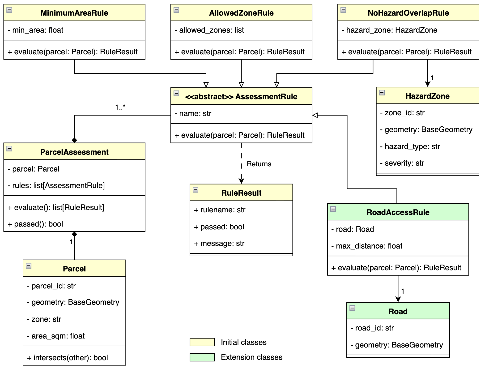

# Laboratory 5: Object-Oriented Spatial Modeling with UML

## Required Dependencies
Before starting, make sure that you have installed the following dependencies:

- **[Python](https://www.python.org/downloads/) >= 3.14**
- **[pip](https://pip.pypa.io/en/stable/installation/) >= 26.2.1**
- *(Optional)* **[VSCode](https://code.visualstudio.com/)**

## Set up the Virtual Environment

### Create a Python Virtual Environment
Create and activate a virtual environment:

```bash
python3 -m venv .venv
source .venv/bin/activate
```

### Install Dependencies
Upgrade pip, then install the required packages:

```bash
pip install --upgrade pip
pip install shapely pytest
```

Freeze the installed packages to `requirements.txt` so the environment is reproducible:

```bash
pip freeze > requirements.txt
```

## Executing the Python Scripts
### Runner script
This is the entry point of the application. Run the runner script using the following command:

```bash
python3 src/run_lab5.py
```

### Test files
**Note:** `test/conftest.py` automatically adds `src/` to the Python path, so test files can import modules (e.g. `from rules import ...`) without needing `src.` prefixes or manual path manipulation.

Run the full test suite with pytest:

```bash
python3 -m pytest tests/ -v
```

# Directory Structure
```text
├── diagrams                        # Design Documentation
│   └── lab5_uml.png                    # UML class diagram for the Lab 5 domain model
├── output                          # Generated artifacts
│   └── lab5_report.json                # Assessment summary produced by run_lab5.py
├── src                             # Application source code
│   ├── assessment.py                   # Coordinates a Parcel against a collection of Rules
│   ├── demo.py                         # Ad-hoc/manual smoke tests and incremental checks
│   ├── rules.py                        # Rule class hierarchy (base Rule + concrete rule types)
│   ├── run_lab5.py                     # Entry point: wires everything together and writes output/
│   └── spatial.py                      # Domain entities (e.g. Parcel, geometry primitives)
├── tests                           # Automated unit tests
│   ├── conftest.py                     # Auto-loaded by pytest before test collection; inserts src/ into sys.path
│   ├── test_assessment.py              # Unit tests for assessment.py
│   ├── test_rules.py                   # Unit tests for rules.py
│   └── test_spatial.py                 # Unit tests for spatial.py
├── README.md                       # Project overview, setup, and usage instructions
└── requirements.txt                # Pinned/declared third-party dependencies
```

# The Problem Overview

The aim of this project is to create a system for a local planning team to **evaluate land parcels** against a series of **independent development rules**. For a parcel to be evaluated by the program, it should contain the following four attributes:
* **Identifier** - the unique identifier for each parcel
* **Geometry** - the spatial property of each parcel
* **Zoning Classification** - the assigned zone type of each parcel
* **Area** - the recorded area measurement of each parcel in square meters

Initially, the program should evaluate the parcel by checking the following:
1. **Minimum Area** - this would verify whether a parcel meets a minimum area threshold
2. **Allowed Zones** - this would check if the parcel's zoning classification is within an approved list of allowable zones
3. **Hazard Zone Intersection** - this would check, flag, and reject any parcel that intersects a mapped hazard zone

For the system and design requirements, the program should be able to do the following:
* Each rule must return a result with three elements: the **rule's name, a pass/fail value (boolean), and a text containing the explanation**.
* Running an assessment on a parcel executes all rules and **combines the results into a single report**.
* The program must be structured in a way that it is **scalable**, meaning, new rules (such as checking road-access proximity) can be added without needing to rewrite or modify the core assessment loop.

# Candidate-Class Table
Below is the candidate-class table derived from the problem statement:

| Phrase from problem   | Initial interpretation    | Keep as class?    | Reason                                                    |
| -------------------   | ----------------------    | --------------    | ------                                                    |
| planning team         | actor/stakeholder         | No                | Users of the system but is not part of this small domain problem |
| parcel                | domain entity             | Yes               | Owns parcel identity, state, and geometry behavior.       |
| parcel identifier     | parcel state              | No                | A primitive value owned by the parcel object.             |
| geometry              | parcel state              | No                | A spatial property owned by Parcel.                       |
| zoning classification | parcel state              | No                | A value carried by Parcel. Represented by a library (Shapely). |
| area                  | parcel state              | No                | A numerical constant value carried by Parcel.             |
| minimum area rule     | specialized rule          | Yes               | Has a threshold and one evaluation behavior.              |
| allowable zone rule   | specialized rule          | Yes               | Implements the zoning whitelist checking behavior.        |
| hazard zone           | domain entity             | Yes               | Has its own identity, geometry, type, and severity.       |
| intersecting hazard rule | specialized rule       | Yes               | Performs spatial intersection check between Parcel and Hazard geometries. |
| parcel assessment loop | coordinator              | Yes               | Evaluates a parcel by orchestrating rule execution.       |
| rule result           | value object              | Yes               | Provides one consistent result shape from all rules.      |
| report                | output representation     | Not yet           | A JSON/dict is sufficient for this exercise; a Report class would add little responsibility. |
| program               | application               | No                | Main script entry point or CLI driver rather than a domain model class. |

# UML Diagram



# Reflections

## 👤 Author
**ALLAN FRITZGERALD N. AMISTOSO** <br>
*2014-73618* <br>
MS Geomatics Engineering - Geoinformatics <br>
University of the Philippines Diliman
